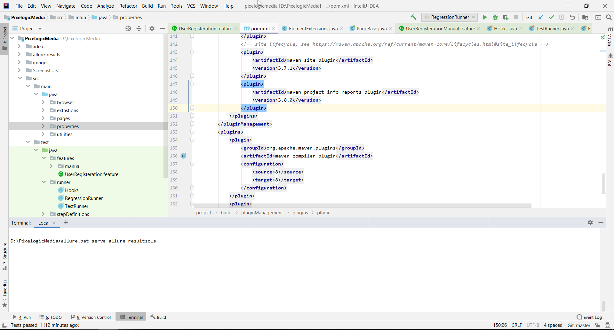

# PixelogicMedia
<!-- PROJECT SHIELDS -->

        
      
      
  
          

<!-- PROJECT LOGO -->
 

  

  <h3 align="center">PixelogicMedia</h3>
   

     
    <a href="#about-the-project"><strong>Read Instructions »</strong></a>
     
       
    <a href="https://github.com/mahmoudazaid/PixelogicMedia/wiki">Read the Wiki</a>
    .
    <a href="https://github.com/mahmoudazaid/PixelogicMedia/issues">Report Bug</a>
    ·
    <a href="https://github.com/mahmoudazaid/PixelogicMedia/issues">Request Feature</a>
  

<!-- TABLE OF CONTENTS -->
## Table of Contents

* [About the Project](#about-the-project)
  * [Built With](#built-with)
* [Getting Started](#getting-started)
  * [Prerequisites](#prerequisites)
  * [Installation](#installation)
* [Usage](#usage)
<!-- ABOUT THE PROJECT -->

## About The Project

This is an automation framework to test the https://www.phptravels.net/ website

### Built With
The Framework built with below main packages
* [Maven](http://maven.apache.org/)
* [Selenium](https://www.seleniumhq.org/)
* [TestNG](https://testng.org/doc/)
* [Cucumber](https://cucumber.io)

### Getting Started
#### Prerequisites
* Install IntlliJ IDE from [here](https://www.jetbrains.com/idea/download/#section=windows)
* Install Java from [here](https://www.oracle.com/technetwork/java/javase/downloads/index.html)
* Setup Java environment variables
* Install Maven from [here](http://maven.apache.org/download.cgi)
* Setup Maven environment variables
* Install Allure from [here](https://github.com/allure-framework/allure2/releases/tag/2.13.0)
* Setup Allure environment variable  
* Install Chrome browser

### Usage
* Clone the project to your local machine
* Import the project to IntlliJ
* Go to `src/test/java/runner` then choose which test suite that you need `TestRunner` or `RegressionRunner` right click and run
* After running finished go to terminal and run this command `allure.bat serve allure-results`
  